# 🎓 Student Registration Portal

A full-stack Student Registration Portal built using React, Node.js, Express, MySQL, and JWT Authentication.

## ✨ Features

- User Registration & Login
- JWT Authentication
- Student CRUD Operations
- Dashboard
- Search Students
- Analytics Page
- Profile & Settings
- Dark Mode UI
- Responsive Design

## 🛠️ Tech Stack

### Frontend
- React
- Vite
- CSS

### Backend
- Node.js
- Express.js

### Database
- MySQL

### Authentication
- JWT (JSON Web Token)

## 📂 Project Structure

```
frontend/
backend/
database/
```

## 🚀 Installation

### Frontend

```bash
cd frontend
npm install
npm run dev
```

### Backend

```bash
cd backend
npm install
npm start
```

## Database

Import

```
database/schema.sql
```

into MySQL.

## Author

**Shalu**

## 📸 Project Screenshots

### Login
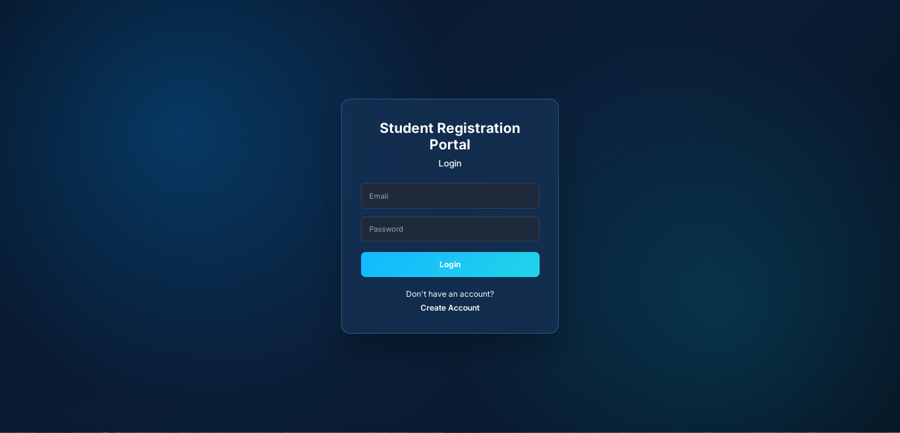

### Register
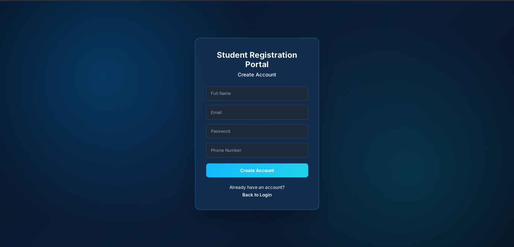

### Dashboard
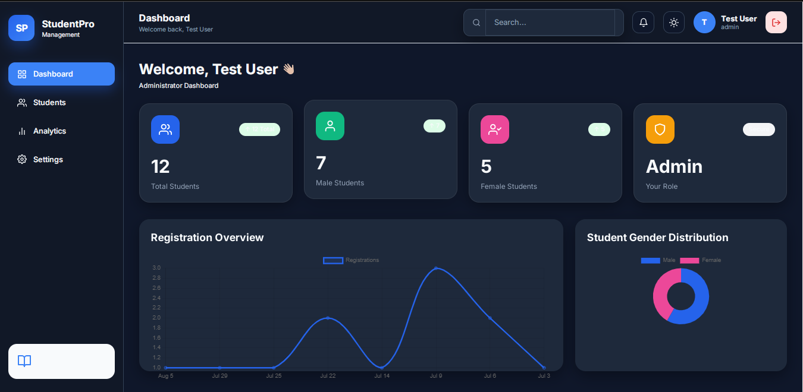

### Dashboard Statistics
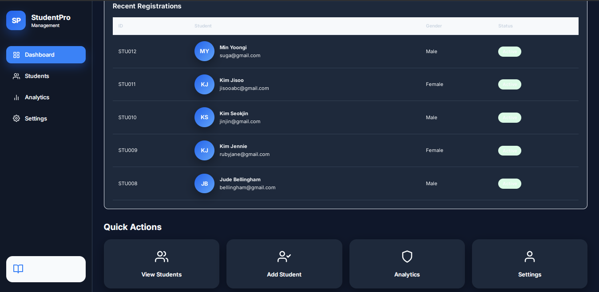

### Students List
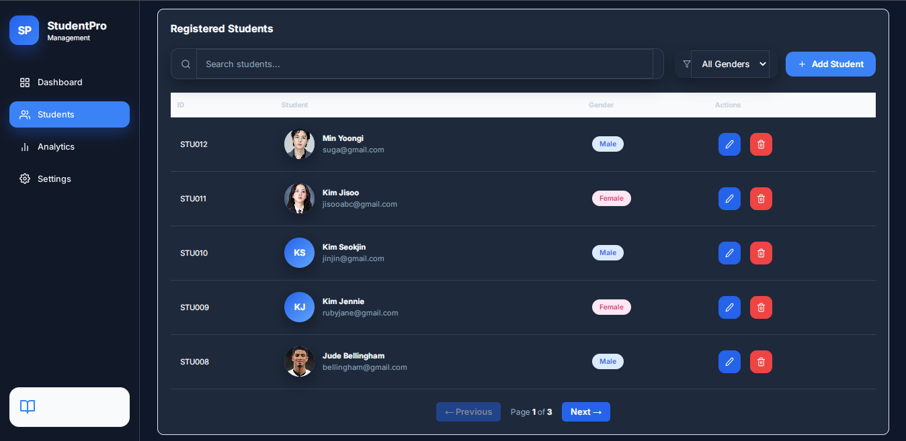

### Add Student
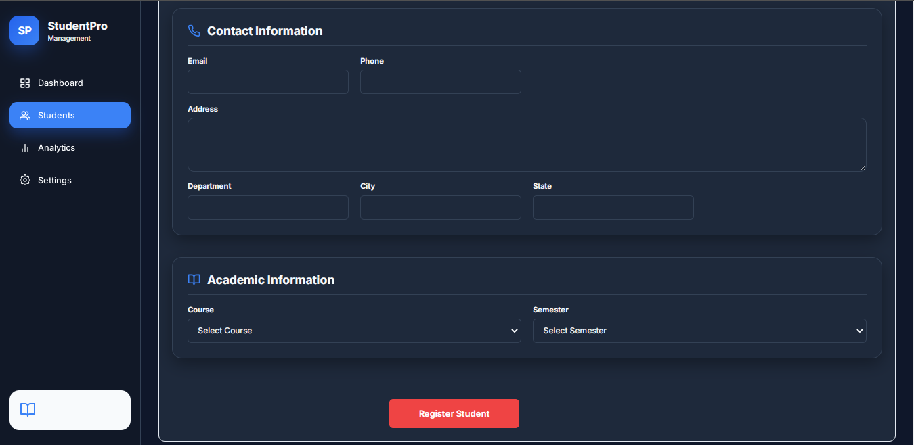

### Student Registration
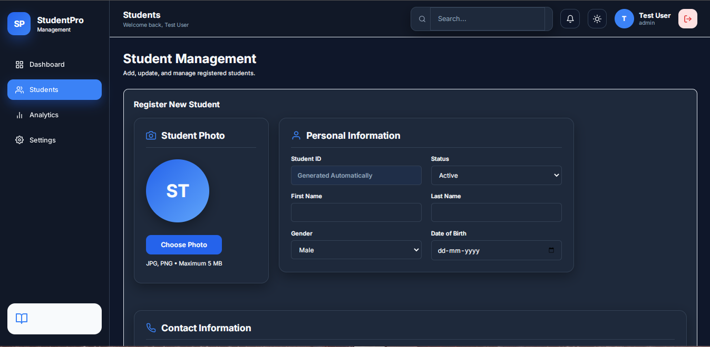

### Analytics Overview
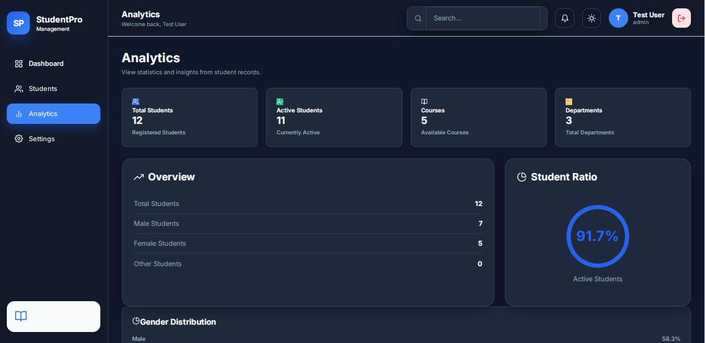

### Analytics Charts
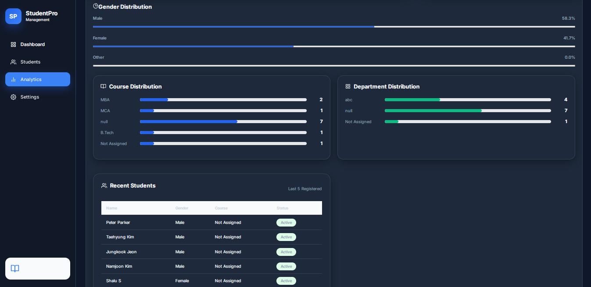

### Profile Settings
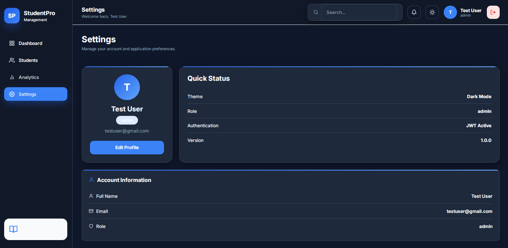

### Security Settings
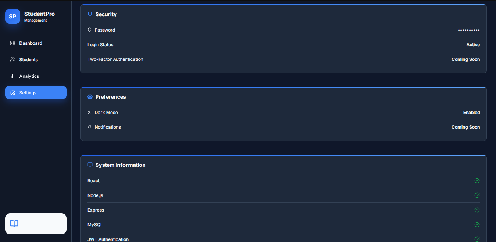

### System Settings
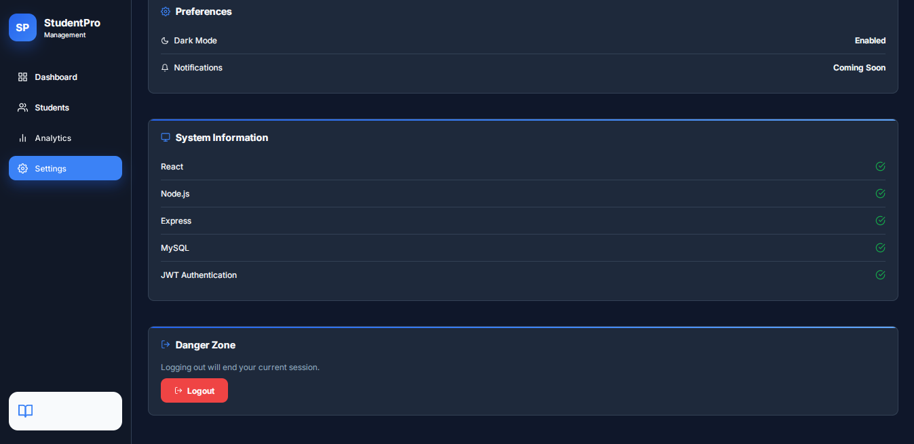
